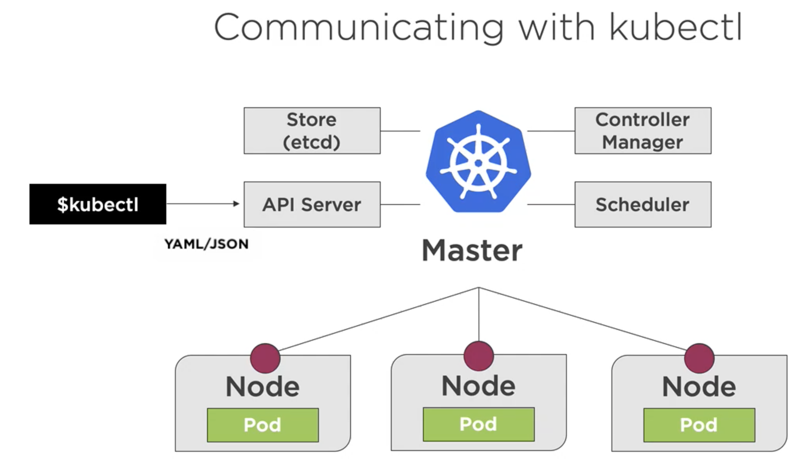
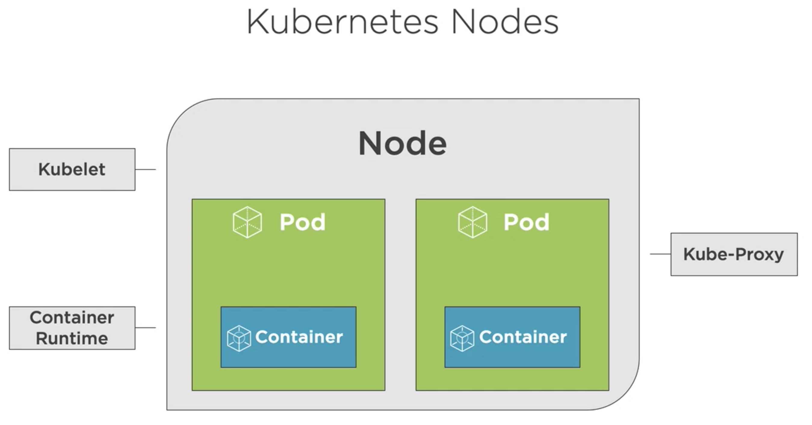
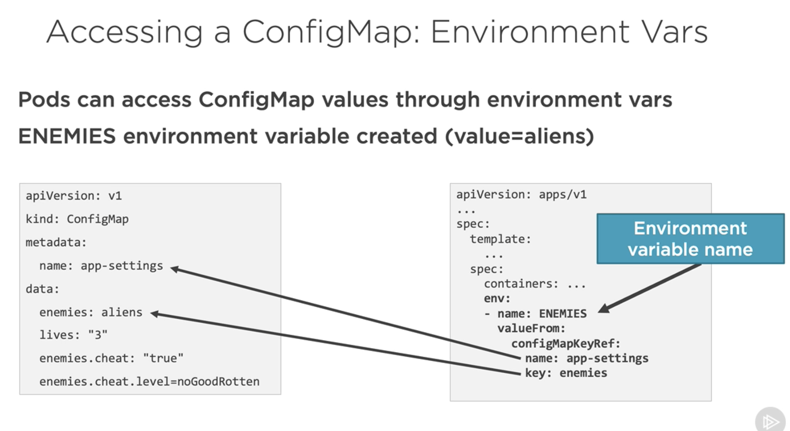

# Kubernetes for Developers: Core Concepts

This is all about the k8s for beginners.

## Kubernetes from a Developer Perspective




### Installing & Running Kubernetes

We can use Minikube for local running K8S or Docker Desktop which is the easiest way to use it. It
just has one master node along with one worker node, but it is good enough.

Go to Docker preferences > Kubernetes > check the enable Kubernetes > click on Install button

### kubectl commands | Creating Pod

We use kubeclt command line to interact with master node.

- `kubectl version`
- `kubectl cluster-info` view cluster information
- `kubectl get all` retreive infomration about Kubernetes Pods, Deployments, Services & more
- `kubectl run [container-name] --image=[image-name]` simply way to create a Deployment for a Pod
- `kubectl port-forward [pod] [ports]` forward a port to allow external access
- `kubectl expose ...` expose a port for a deployment/pod
- `kubectl create [resource]` create a resource
- `kubectl apply [resource]` create or modify a resource if already exists

YML file:

```
apiVersion: v1      > Kubernetes API version
kind: Pod           > Type of Kubernetes resource
metadata:           > Metadata about the Bod
  name: my-nginx
spec:               > The spec/blueprint for the Pod
  containers:       > Information about the containers that will run in the Pod
  - name: my-nginx
    image: nginx:alpine
```

To run the yml file:

`kubectl create -f file.pod.yml --dry-run --validate=true` We use --dry-run to check whether all
is ok but it will not create anything. The --validate is a default value to be true.

It is better to use apply instead if the pod does not exist it will be created or updated

`kubectl apply -f file.pod.yml`

To create a pod via yml file:
`kubectl create -f nginx.pod.yml --save-config` The --save-config is to save pod configuration which
can be found in annotations section after running `kubectl get pod my-nginx -o yaml` -o stands for
output. Another way to get inside of pod we can run `kubectl describe pod my-nginx`. --save-config should be used always with the create verb.

To get into running container inside of pod we can do the same like in Docker
`kubectl exec [pod-name] -it sh`

We can also edit yml file with `kubectl edit -f nginx.pod.yml`
And delete a pod `kubectl delete -f nginx.pod.yml`

Updated with liveness & readiness YML file:

```
apiVersion: v1      > Kubernetes API version
kind: Pod           > Type of Kubernetes resource
metadata:           > Metadata about the Bod
  name: my-nginx
spec:               > The spec/blueprint for the Pod
  containers:       > Information about the containers that will run in the Pod
  - name: my-nginx
    image: nginx:alpine
  livenessProbe:
    httpGet:
      path: /index.html
      port: 80
    initialDelaySeconds: 15
    timeoutSeconds: 2
    periodSeconds: 5
    failureTreshold: 1
  readinessProbe:
    httpGet:
      path: /index.html
      port: 80
    initialDelaySeconds: 15
    periodSeconds: 5

```

### Deployments

```
apiVersion: apps/v1
kind: Deployment
metadata:
  name: my-nginx
  labels:
    app: my-nginx
spec: # overall spec
  minReadySeconds: 10 # to wait 10 seconds before we start receiving traffic
  replicas: 4
  selector: # select Pod template label(s) to use
    matchLabels:
      app: my-nginx
  template: # this template could be here or placed in another file
    metadata:
      labels:
        app: my-nginx
    spec: # This contains containers that will run in the pod (generaly one container per pod)
      containers:
        - name: my-nginx
          image: nginx:alpine
          ports:
            - containerPort: 80
          resources:
            limits:
              memory: "128Mi" # 128MB
              cpu: "200m" # 200 milicpi (.2 cpu or 20% of the cpu)

```

`kubectl create -f nginx.deployment.yml --save-config`
`kubectl describe [pod | deployment] [pod-name | deployment-name]`
`kubectl apply -f nginx.deployment.yml`
`kubectl get deployments --show-labels`
`kubectl get deployments -l app=my-nginx` -l stands for label
`kubectl scale -f nginx.deployment.yml --replicas=4`

### Creating Services

A service provides a single point of entry for accessing one or more Pods.

Services types:

- ClusterIP - Expose the service on a cluster-internal IP (default)
- NodePort - Expose the service on each Node's IP at a static port
- LoadBalancer - Provision an external IP to act as a load balancer for the service
- ExternalName - Maps a service to a DNS name

`kubectl port-forward deployment/my-nginx 8080:80`

Creating service via yml:

```
apiVersion: v1      > Kubernetes API version and resource type (Service)
kind: service
metadata:           > Metadata about the service
spec:
  type:             > Type of service (ClusterIP, NodePort, LoadBalancer) - defaults to ClusterIp

  selector:         > Select Pod template label(s) that service will apply

  ports:            > Define container target port and the port for the service
```

Example:

```
apiVersion: v1
kind: Service
metadata:
  name: nginx-clusterip
spec:
  type: ClusterIP
  selector:
    app: my-nginx
  ports:
    - port: 8080
      targetPort: 80
```

`kubectl create -f clusterIP.service.yml --save-config`
or
`kubectl apply -f clusterIP.service.yml`

`kubectl get services`

### Storage

We can store data among other Pods via Volumes or of course we can use DB.

A Volume can be used to hold data and state for Pods and containers.

- A pod can have multiple Volumes attached to it.
- Containers rely on a mounthPath to access a Volume
- Kuberentes supports:
  - Volumes
  - PersistanceVolumes (to connect external storage)
  - PersistanceVolumeClaims
  - StorageClasses

Volumes & Volume Mounts:

- a Volume references a storage location.
- must have a unique name
- attached to a Pod and may or may not be tied to the Pod's lifetime (depending on Volume type)
- a Volume Mount references a Volume by name and defines a mountPath

### Creating ConfigMaps & Secrets

ConfigMaps provide a way to store configuration information and provide it to containers.

ConfigMaps can be accessed from a Pod using:

- Environment variable (key/value)
- ConfigMap Volume (access as files)

Creating a ConfigMap

via ConfigMap Manifest

```
apiVersion: v1
kind: ConfigMap
metadata:
  name: app-settings
  labels:
    app: app-settings
data:
  enemies: aliens
  lives: "3"
  enemies.cheat: "true"
  enemies.cheat.level=noGoodRotten
```

`kubectl create -f file.configmap.yml --save-config`

via defining kye/value pairs in a file

enemies=aliens
lives="3"
enemies.cheat="true"
enemies.cheat.level=noGoodRotten

`kubectl create configmap [cm-name] --from-file=[path-to-file]`

or from env file
`kubectl create configmap [cm-name] --from-env-file=[path-to-file]`

`kubectl get cm [cm-name] -o yaml` to print configMap


